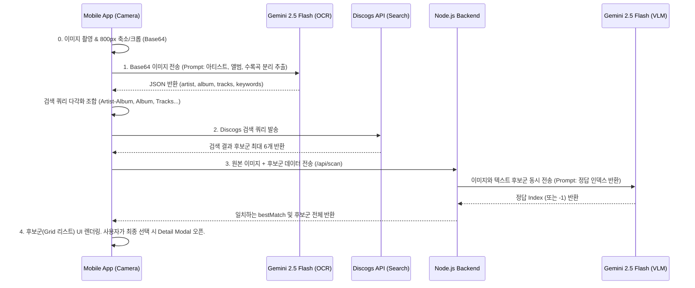

# 📸 Image Scan Pipeline (100% Free Gemini Architecture)

## 📌 개요
사용자가 모바일 앱에서 LP 앨범 커버를 촬영하면, 해당 앨범을 식별하고 프라이빗 컬렉션에 추가하기 위한 핵심 파이프라인. 기존의 유료 Google Cloud Vision API 및 무거운 로컬 VibeProxy 서버를 완전히 걷어내고, **Gemini 2.5 Flash를 1단계(OCR)와 3단계(대조)에 모두 활용하여 100% 무료 무과금 환경**을 구축했습니다.

---

## ⚙️ 파이프라인 흐름도

---

## 🛠 각 단계별 핵심 최적화 기술

### 단계 0: 이미지 최적화 (모바일)
- 모바일 고화질 카메라 사진을 그대로 Base64 인코딩하면 전송이 너무 느림.
- `expo-image-manipulator`를 사용하여 앨범 영역(300x300 비율)을 우선 크롭한 뒤, **`resize: { width: 800 }`** 으로 대폭 축소.
- `quality: 0.3` 설정을 통해 1/10 수준의 용량 다이어트 성공 (인식률 저하 없음).

### 단계 1: 시각적 정보 추출 (Gemini OCR)
- **과거**: 결제 연동이 필수인 Google Cloud Vision API를 사용하여 에러(403) 발생.
- **현재**: Gemini 2.5 Flash가 이미지를 보고 텍스트(OCR)와 분위기(Keywords)를 한 번에 추출.
- **프롬프트 엔지니어링**: 단순히 전체 텍스트를 긁어오지 않고, `artist`, `album`, `tracks` 필드를 가진 JSON으로 응답하도록 강제. 한국 가수의 경우 정확한 한글 유추를 명시하여 오타 보정력 극대화.
- **Thinking 토큰 제어**: `maxOutputTokens: 2048`, `thinkingBudget: 0`을 설정하여 Gemini가 내부 생각에 토큰을 낭비하다 응답이 잘리는 현상 방지.

### 단계 2: 다각화된 쿼리 검색 (Discogs)
- 추출된 JSON 데이터를 순차적 쿼리로 조합.
  1. `[아티스트] - [앨범]` (가장 정확한 콤보)
  2. `[앨범]` 단독
  3. `[아티스트]` 단독
  4. `[트랙리스트 곡 제목]` (앨범명은 흔하지만 수록곡 제목이 특이할 때 유효)
  5. `[키워드]` (최후의 폴백)
- 여러 개의 쿼리를 순차적으로 쏘아 매칭되는 후보군(최대 6개) 확보.

### 단계 3: VLM 최종 대조 (백엔드)
- 모바일 앱은 원본 Base64 이미지와 2단계에서 확보한 후보군의 `[TITLE, ARTIST]` 목록을 묶어 백엔드로 전송.
- 백엔드는 VibeProxy 없이 직접 Gemini 2.5 Flash를 호출하여 "이미지 속 앨범과 가장 일치하는 텍스트 번호를 골라라" 명령.
- 백엔드 역시 `thinkingBudget: 0` 옵션을 켜서 응답 지연을 방지.

### 단계 4: 후보군 확인 UX (모바일)
- 기존에는 AI가 완벽히 매치했다고 판단하면 곧바로 상세 모달을 띄웠으나, 오작동 시 사용자 혼란 유발.
- 현재는 매칭 성공 여부와 상관없이 **무조건 후보군 그리드 리스트를 먼저 렌더링**하여 사용자가 눈으로 후보들을 비교하고 선택할 수 있도록 자유도 보장.
