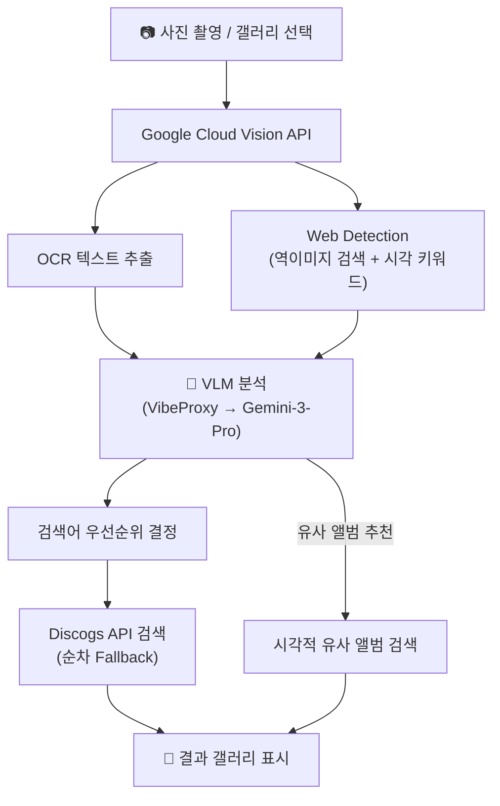

# 📸 이미지 검색 (앨범 스캔) 파이프라인 및 개선 사항

이 문서는 사용자가 LP 레코드 커버를 촬영했을 때 작동하는 이미지 인식 기반 검색 시스템의 작동 원리와 향후 고도화(개선) 목표를 관리하기 위한 문서입니다.

## 1. 아키텍처 파이프라인

### 1단계: Google Cloud Vision API (`visionAPI.ts`)
- **입력**: Base64 인코딩된 앨범 커버 이미지
- **요청 기능**: `TEXT_DETECTION` (OCR) + `WEB_DETECTION` (역이미지 검색)
- **출력**:
  - `textAnnotations`: 커버에서 읽은 텍스트 (예: `"YANG SOO KYUNG"`)
  - `webDetection.webEntities`: 구글이 인식한 시각적 키워드 (예: `"Wave to Earth"`)
  - `webDetection.pagesWithMatchingImages`: 동일 이미지가 게시된 웹페이지 URL

### 2단계: VLM 분석 (`visionAPI.ts`)
- **프록시**: VibeProxy (`http://192.168.0.24:8317/v1/chat/completions`)
- **모델**: `gemini-3-pro`
- **입력**: OCR 텍스트 + 시각적 키워드 (Web Entities)
- **역할**: OCR 텍스트를 사람처럼 해석하여 정확한 "아티스트 - 앨범명" 유추 + 시각적 유사 앨범 추천

### 3단계: 검색어 우선순위 결정 (`ScanScreen.tsx`)
1. **Discogs URL 추출**: 역이미지 검색에서 `discogs.com` 페이지가 발견된 경우 URL에서 직접 추출 (최고 정확도)
2. **VLM 유추 결과**: LLM이 분석하여 유추한 정답
3. **OCR 텍스트 줄**: 커버에서 읽은 텍스트 줄 단위 스캔 (숫자 쓰레기 필터 적용)
4. **Web Entities**: 구글 비전이 인식한 시각적 키워드

### 4단계 & 5단계: Discogs 순차 검색
- 추출된 우선순위 검색어를 최대 5개까지 순차적으로 Discogs API에 요청
- Rate Limit(429) 방지를 위해 각 Fallback 검색 간 **1.5초**, 유사 앨범 검색 간 **0.5초** 대기

---

## 2. 주요 파일

| 파일 | 역할 |
|------|------|
| `visionAPI.ts` | Google Vision API 호출 + VLM 프록시 연동 파이프라인 |
| `ScanScreen.tsx` | 검색어 최적화 생성 로직 + Rate Limit 관리 + 화면 렌더링 |
| `DetailModal.tsx` | 앨범 상세 모달 및 DB 콜렉션 실시간 상태 동기화 |
| `externalApi.ts` | Discogs/Apple Music 등 외부 API 래퍼 |

---

## 3. 알려진 한계점 (Known Limitations)

1. **VLM 502 에러**: VibeProxy가 불안정하여 VLM 분석이 자주 실패함. Fallback 로직이 있지만, VLM 없이는 시각적 유사 앨범 추천이 불가능하고 OCR만으로 정확도가 다소 떨어짐.
2. **OCR 정확도**: 손글씨체, 예술적 폰트, 반사광이 심한 LP 커버에서 OCR이 엉뚱한 텍스트를 읽을 수 있음.
3. **시각적 유사 앨범의 한계**: VLM이 추천한 앨범이 실제로 시각적으로 완벽히 유사한지는 VLM의 학습 데이터에 전적으로 의존하며, 때로는 실존하지 않는 앨범명을 생성(할루시네이션)할 수 있음.
4. **Apple Music 커버 매칭 실패**: 80~90년대 한국 앨범 등은 Apple Music에 등록되지 않아 고해상도 커버 대신 Discogs 원본의 저화질 커버가 노출됨.

---

## 4. 🚀 향후 개선 사항 (TODO)

- [ ] **VLM 직접 연동 (프록시 제거)**: VibeProxy를 거치지 않고 Gemini API를 직접 호출하거나, 이미지 압축 후 전송 파이프라인을 구축하여 `502 Rate Limit` 에러 원천 차단.
- [ ] **멀티모달 이미지 직접 전송**: 시각적 특징을 텍스트로 변환해서 묻는 대신, 사용자가 찍은 이미지를 최적화(리사이징/압축)하여 VLM에 직접 전송함으로써 더 정확한 이미지 인식 구현.
- [ ] **이미지 임베딩 기반 유사도 검색**: LLM의 텍스트 추천이 아닌, CLIP 등의 이미지 임베딩 모델(Vector DB)을 도입하여 실제 커버 이미지 픽셀의 시각적 유사성을 벡터로 비교하는 방식으로 진화.
- [ ] **OCR 후처리 고도화**: 한/영 혼용 텍스트에 대한 자동 분리(예: `"YANGSOOKYUNG"` → `"YANG SOO KYUNG"`) 정규식 개선.
- [ ] **마스터 ID 기반 단건 조회**: 역이미지 검색에서 Discogs URL이 식별될 경우 검색(`searchDiscogs`)을 거치지 않고 마스터 ID로 직접 단건 조회(`getAlbumMaster`)하여 100% 일치율 달성.
- [ ] **스캔 결과 로컬 캐싱**: 이미 한 번 스캔한 사진(Hash 기반)은 Vision API를 다시 호출하지 않고 기기에 캐시된 결과를 즉시 반환하여 API 비용 절감 및 속도 향상.
